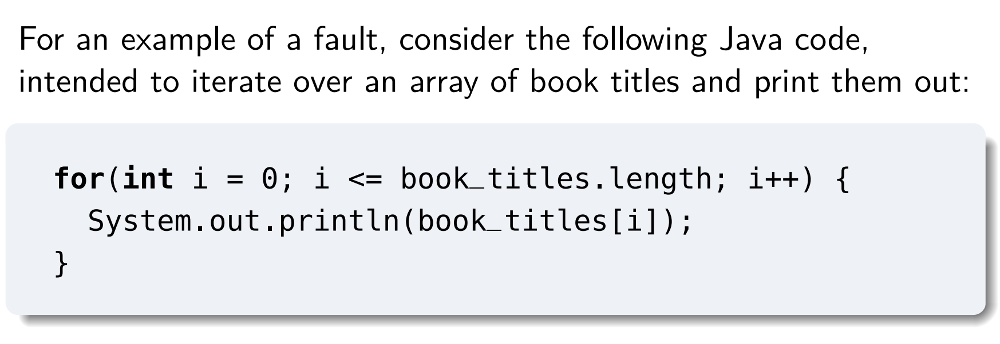
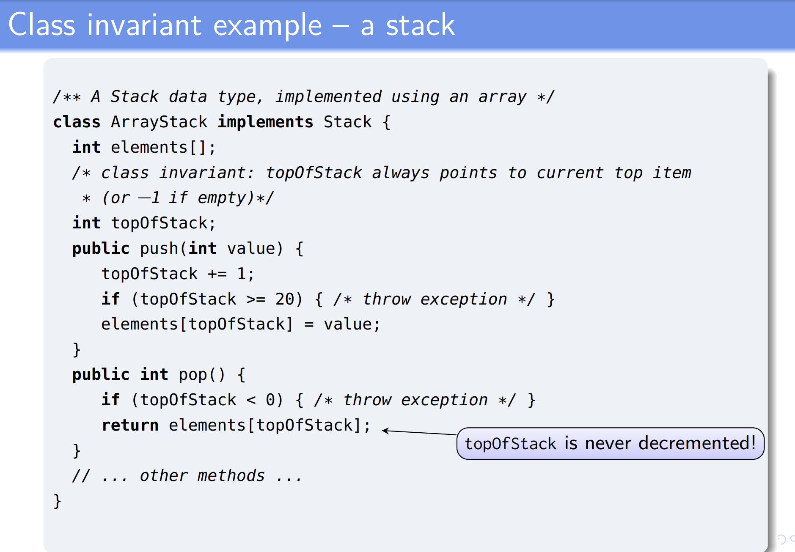
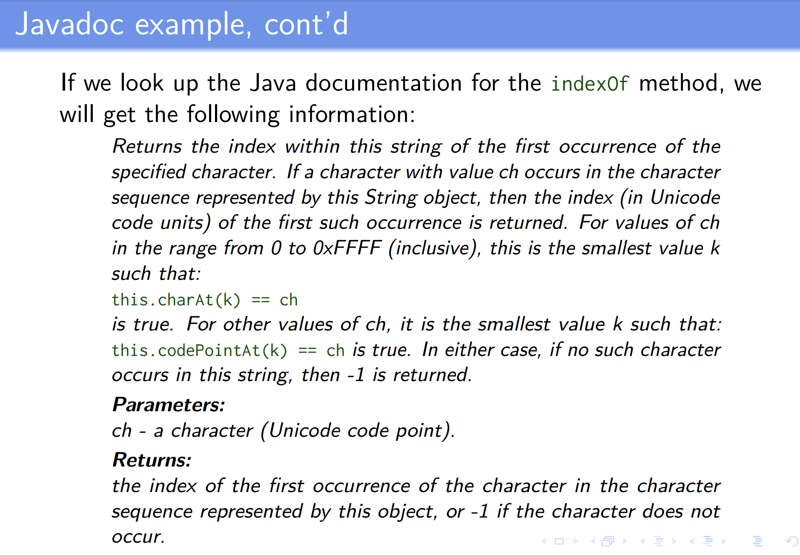
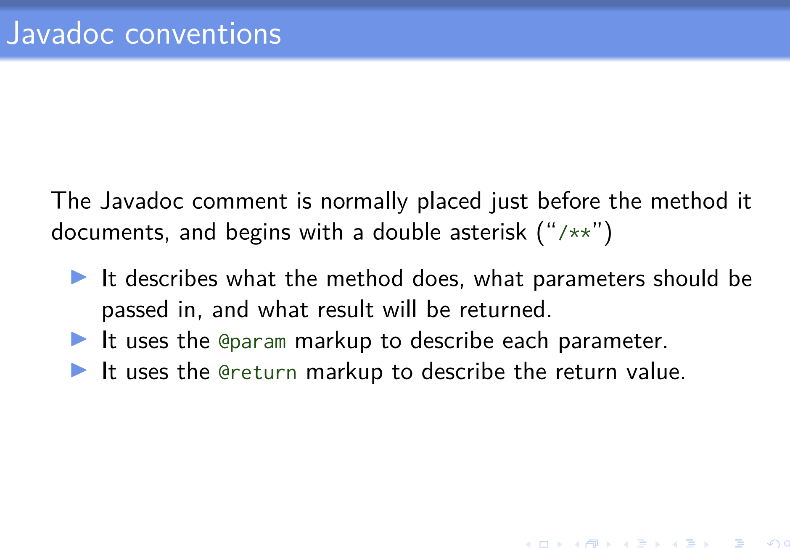
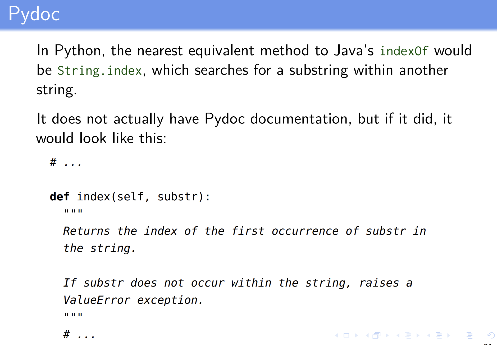
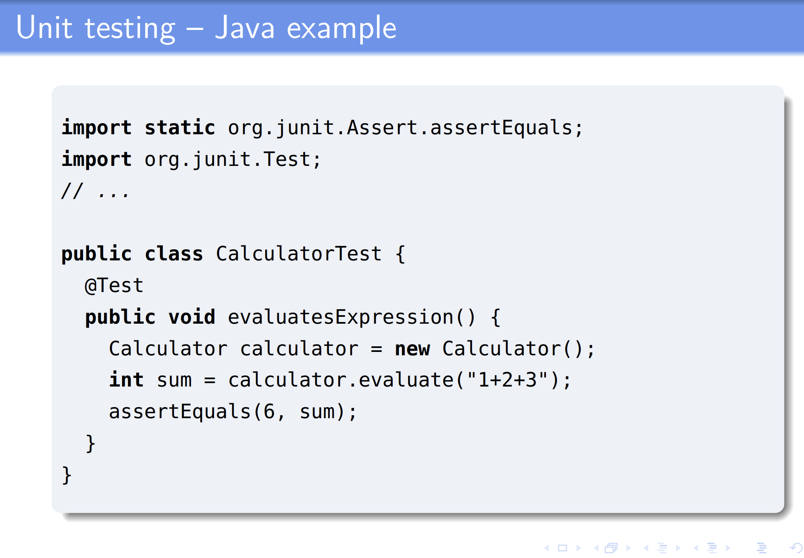
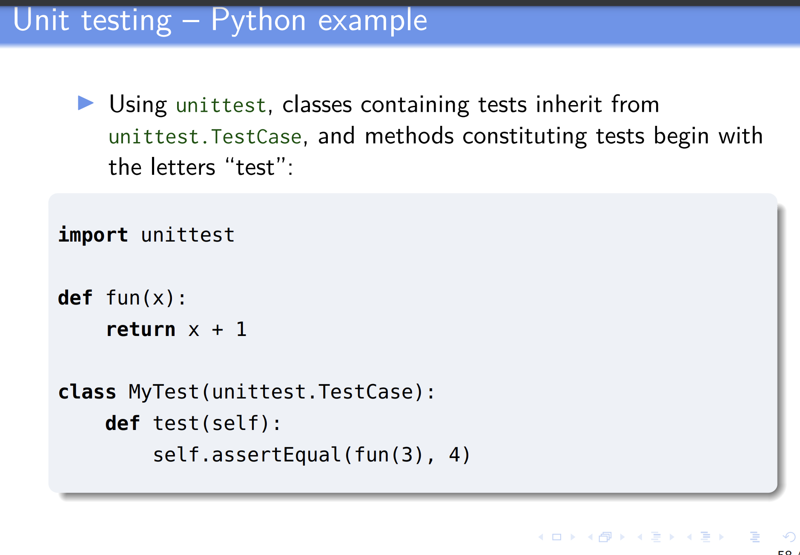
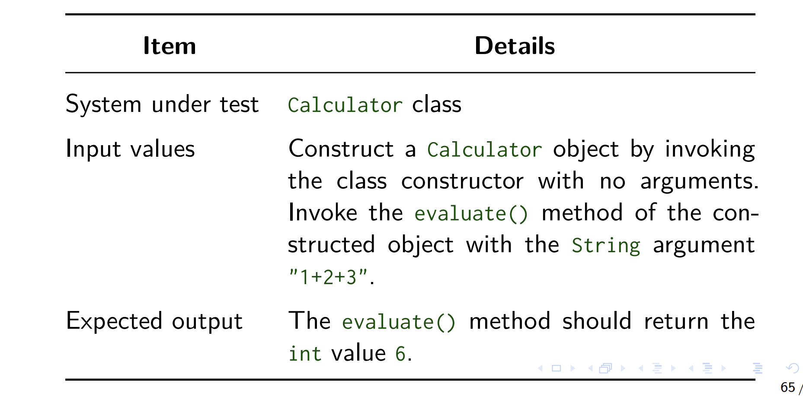
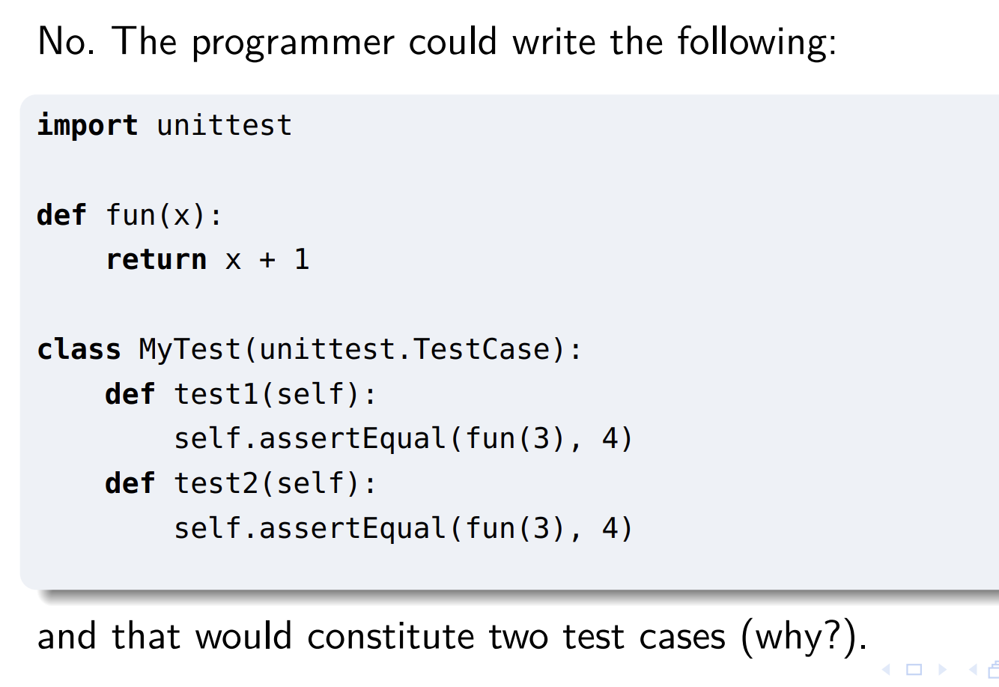
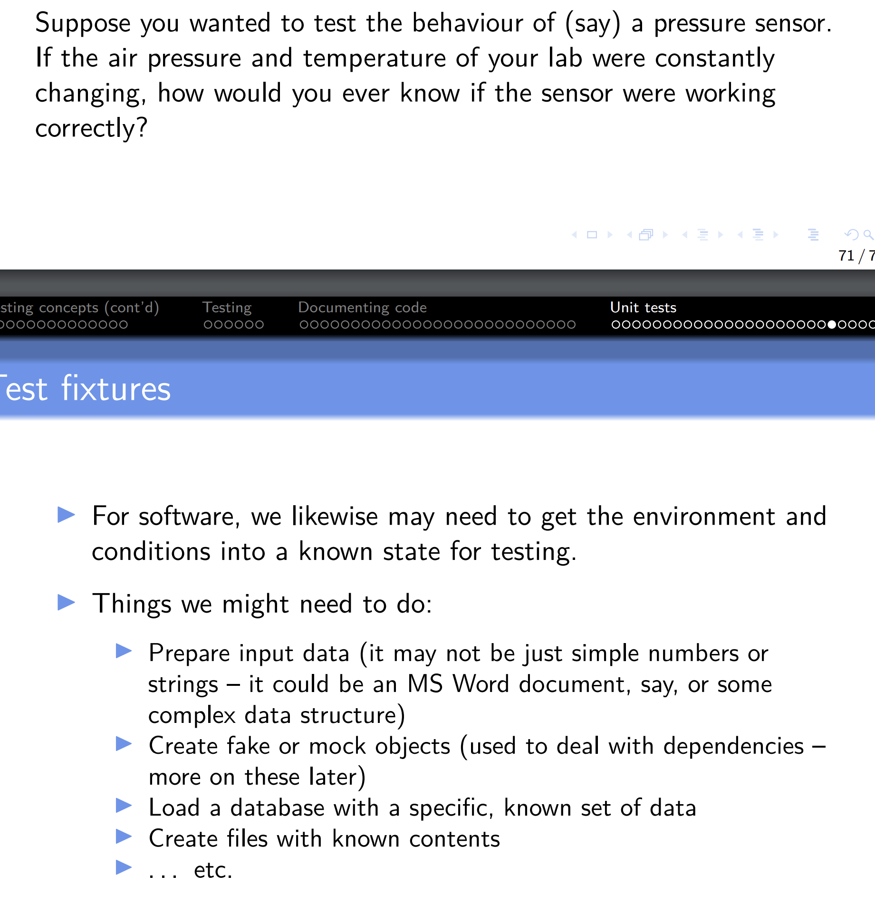

# Hightlights

- Documentation and APIs: how do we work out what the correct behaviour of a piece of software is _so that we can test it?_
- Unit testing: What is unit testing, what is the terminology, and how do we write unit tests?

# Faults, failures and errors

- In normal English, we might not make much distinction between them.

## in software engineering:

- the behaviour of a running system (what we can observe about what the system does)
- the static artifacts for which the system is produced (e.g. files of source code, or data files in formats like HTML or CSS)
- the runtime state of the system (i.e., what's currently stored in memory)

# Failure

- Recall that:
  - A failure is any deviation of the observed behaviour of a program or system from the specification.
- It describes the system's behaviour
- (Can we say a file of source code contains a "failure"? No. But can we say a failure occurs when some program is run? Yes)

# Failure e.g.

- Ctrl+s -> should save the file, but crashes when the filename contains a space
  - The program would be failing to meet a functional requirement
- If a program should always respond to user input within 0.1 sec, but instead starts "lagging" when more than 5 document are opened
  - This time, the program would be failing to meet a non-functional requirement, that the system meet particular standards for responsiveness
- If an electronic voting booth should accurately record votes cast , but due to a cosmic ray flipping a bit in memory, 4096 addtional votes are counted for one candidate
  - that is also a failure
- **failures are systems failied to fulfill the specification or its functionality design.**

# Faults

- also called bugs or defects - A fault is something in the statci artifacts of a system that cause a failure
  
  Should be "<"

# wider definition of faults

- Some sources will use "fault" more broadly to mean the cause of a faliure besides just defects in the code - e.g. perhaps cosmic rays - but we'll mostly be concerned with problems in the code.
- Not every failure can be tracked back to a _single spot_ in the code: failures of security, scalability, performances etc. are global properties of the system artifacts.

# Erroneous State

- By "**Error**" or "**Erroneous state**", the textbook authors mean the situation at runtime, where some fault has become reflected in the system's runtime state
  - So you can have a fault in the code (e.g. off-by-one Java loop error in previous pic), but if we execute the program and (at least this time round) that bit of code doesn't happen to get run, we don't get a corresponding erroneous state

# Invariants

- We will mostly be interested in erroneous states that happen because some class or program invariant has been violated
- ## **invariant has been violated->lead to system erroneous status**

# e.g. Class invariant example - a stack

- here: class invariant: topOfStack always points to current top item (or -1 if empty)
  

# Reliability

- The reliability of a system is the degree to which its **observed behaviour** conforms to its **specification**

# Testing

# Definition

- We define testing as a systematic attempt to find faults in a software system in a planned way.

# What sorts of things can we test?

- test some code which is a small part of a large system
  - for instance: a single procedure, method or function
  - unit test
- test how units, classes, modules or other components of a system work together
  - intergration testing
- test an entire system
  - system testing
- we can test whether the system meets its specifications (system testing proper), and whether it properly executes some scenario in ana appropriate environment
  - end-to-end testing
- We can also classify them by the purpose of the test, or when in the software development lifecycle the testing activity occurs:
  - After making a change to some component
    - havent changed more than what you want to change
    - an enhancement, or bug fix, or re-factoring
    - we can check whether it still passes all relevant test.
    - regression testing
  - On delivery of a system: we can 'test' whether a system meets a customer's expectations
    - acceptance testing
      ...

# Testing

- testing requires a different mind-set from construction:
  - when

# Unit testing and unit specifications

- We'll start by looing at the "lowest" level of tests, unit tests
- When we test a unit of code, we aim to (by finding faults and removing them) increase our confidence that it meets its specifications
  - If we dont have any specifications for it, that obviouly makes life difficult
- So in general, we aim to document the intended behaviour of any externally accessible unit
  - (Some units might be purely internal - "protected" or "private", for instance, in Java - it is usually good practice to document those as well)

# Documenting units

- Most modern languages provide some way of docuenting the specification of units inline

  - (in the body of the code, rather than in a separate reference manual)
    and extracting that documentation for use by developers.

- For instance

  - Javadoc
  - Pydoc

- For language which do not have such a tool,
  - Doxygen - like javadoc

# Javadoc

- Consider the taskof finding the position of the first occurrence of some character in a string
  - Java:
    - String.indexOf()
  - Signature:
    - int indexOf(int ch)
  - That is, it takes an int and returns an int

# e.g.:

# Javadoc e.g.

- Key points from the Javadoc documentation:
  - When we call someString.indexOf(**ch**):
    - If **ch** is _not_ in someString, the method returns -1.
    - If **ch** is in someString, the method returns "the smallest value k such that > this.codePointAt(K) == **ch**"

# Pydoc

# Pydoc

- Intead of returning -1 when the string dose not occur, Python throws an exception
- In Python
  -exception are often thrown to indicate the absence of something

# API

- Application Programming Interface
- The name derives from the idea that if we write a re-usable component of some sort(like a library), then other developers will want to use this in their application programming, and we should document the public _interface_ to that component

# APIs as contracts

- We can think of the API for a function as constituting a _contract_ between the developer of the function, and the client code using it

# APIs cont'd

- The behaviour of the function
  - will usually be to renturn some sort of value
    to cause some sort of "side effect"

# APIs - specification vs implementation

- The API documentation does not normally say how the fucntion is to be implemented
  - just what its return value and effects are
- This means that if the library developer decides to reimplement the function in another way (for instance, to improve efficiency), they can, without changing the API

# e.g.

- Oracle corporation provides an implementation of the Java standard libraries (as well as of the Java coomplier, javac, and JVM)

# specification also gives how it does it

-

# What should go in the API documentation?

- The _preconfitions_
  - any conditions which should be satisfied by the parameters or the system state when the function is called
- The _postcondition_
  - the return value of the function, and any changes the function makes to the system state ("side effects")
- Sometimes the postcondition will vary, depending on the arguments passed:

  - "IF a valid email address is supplied, THEN the emailMyResignationLetter()" method wil email a resignation letter. But if not, then a MalformeedEmailAddress exception will be thrown"

- ## We need to make sure we cover all circumstances, so that users of an API will know what to expect

- If the precondiction are not satisfied, then the behaviour is **undefined**
- This means the user has failde to live up to their part of the "bargain", and has NO guarantees about what the system might do.

# e.g. java: binarySearch

## Precondition+Postcondition->ready to write tests for it

# Unit tests

- Unit tests should focus on one tiny bit of functionality, and attempt to find any deviations from expected behaviour

# Desirable properties of unit tests

- unit tests should be
  - quick to run
    - We want developers to run test whenever changes are made to the code, or at least when they are committed to version control.
  - independent of other tests.
    - Tests should not rely on other particular tests having been run before them
  - run frequently.
    -We want to identify faults as early as possible
    - Most version control systems make it possible to perform particular tasks whenever code is committed, using "hooks"
    - It's therefore possile to run tests every time code is committed
      - if tests arent quick to run, developers may avoid committing code regularly.

# Unit testing -Java e.g.

- In java, methods which are intended to be run as tests are labelled with the annotation **org.junit.Test**
- The test framework can then be used to run a test:
  - $ java -cp .:junit-4.01.jar org.junit.runner.JUnitCore CalculatorTest

# Testing terminology

- test case

  - the basic unit of testing, which checks the observable behaviour or characteristics of a component or system in response to a particular ste of inputs
  - In consist of one particular set of input data, and the expectted output (behaviour)

- system under test

  - the component or system being tested, whose behaviour we want to observe
  - Sometime also called the _unit under test_ /UUR, or _application under test_ /AUT
  - We'll use "subject under test" to refer to any or all of these
  - "test object"

- test suite
  - a collection of test cases (or other test suites)
- test runner
  - a software tool which manages the execution of tests, and reports their outcome
- test fixture
  - the preparation needed to perform one or more tests

# Test case

- The basic unit of testing, which checks the observable behaviour or characteristics of a component or system in response to a particular set of inputs
- It consists of one particular set of input data, and the expected output (behaviour)

- A test case could be testing:

  - How a method or function behaves when invoked (unit test)
  - How two classes interoperate (intregrate test)
  - How an entire system
    - say, a command-line program
    - behaves when run from the command-line
    - (system test)
  - Whether a system meets some criterin for usability (accepetance test)

- Some Questions:

  - If you're asked to suggest a test case
    - are you being asked to write code?
  - If some Python programmer has written a class which inherits from unittest.TestCase

    - does that mean the class represents exactly one test case?

  - A test case is not code
    - you are being asked to describe, and usually justify
      - a set of inputs which can be supplied to a component or system
      - and the expected output

# Describing test cases

- A good way to describe a test case (especially if there are several test cases you'll need to describe) is to put it in a table.
- At a minimum:
  - SUT:
    - What the sustem under test
  - Input value:
    - What values you supply in order to put the SUT into an appropriate state, and invoke the desired behaviour
  - Expected output:
    - What expected behaviour or characteristics you expect to see (and possibly, what actions and/or measurements you'll take in order to observe them)

# Test cases vs code

- Consider:
  - if some Python programmer has written a class which inherits from unittest.TestCase - does that means the class represents exactly one test case?
    

# Test fixtures

- The preparation needed to perform one or more tests

- The idea of a "fixture" comes from testing of hardware 
  - a "fixture" is everything that holds the piece of hardware in place, and provides you with known environment and conditions it can be tested in

