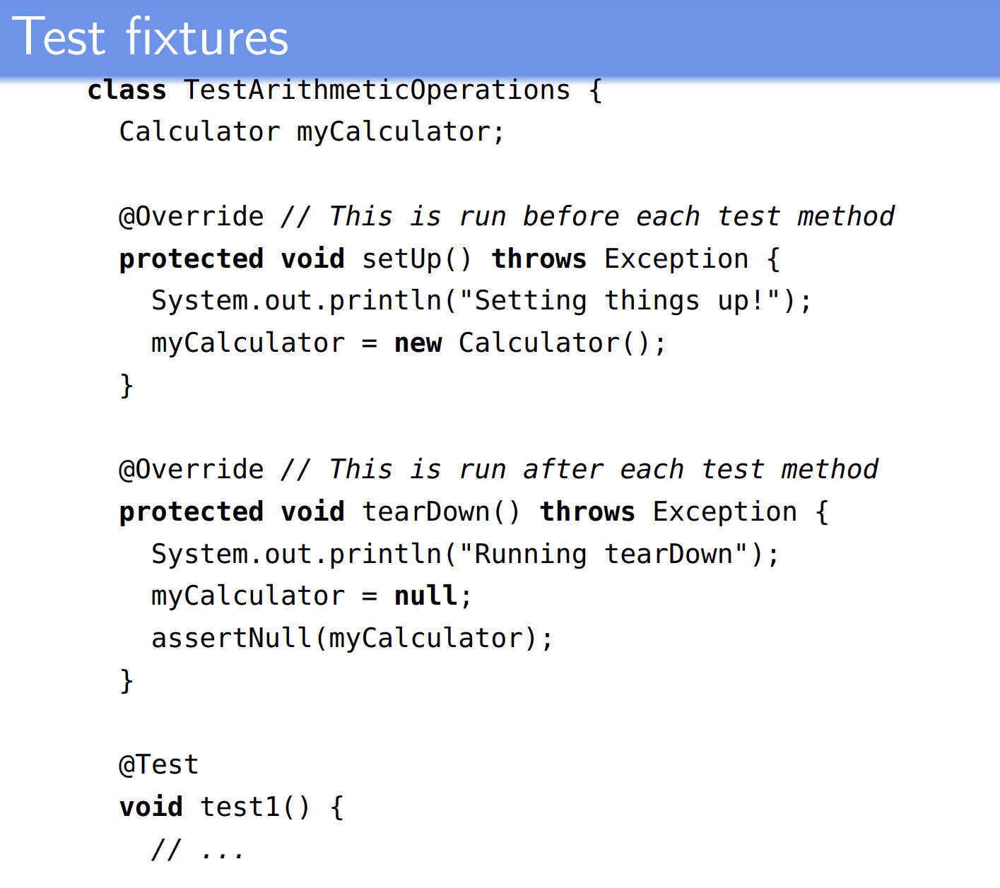

# Test Automation

# Test structure

- ## a test case needs to do the following three things:
  - Prepare the system (and/or an appropriate environment) so that it's in a suitable state for us to invoke some behaviour
  - Invoke the desired behaviour
  - Work out whether the system did what we expected it to

# Arrangee-Act-Assert

- if you test is going to be implemented as code, it's often helpful do each of the three things we mentioned in exactly the order given. if you do so, then you're following the **Arrange-Act-Assert** pattern for writing tests.
- **Arrange**
  - Set up an appropriate environment
- **Act**
  - Invoke the desired behaviour
- **Assert**
  - Work out what the observed behaviour was, and check whether it's the same as the expected behaviour

# More complex "assertions"

- In the code examples we've seen, it's very simple to check whether the observed behaviour matches the expected behaviour
- All we expected the method under test to do was return a vlue and it's very simple to check whether that value is what we expected.
- But what if the specification for the **evaluate()** method said that the result shouldn't be returned, but rather written to a file called "**myresult.txt**"
- ## How can we tell if the test passed or failed?
  - We'd need to run extra methods to open that file, read its contents, and check that the contents was what we expected. All this would be part of the "assertion" stage

# Terminology:

- test value:
  - anything required to set up a system or component, "ask it do" something, observe the result, and clean up the system so as to put it back in a stable state
- expected values:
  - what the system is expected to do
- "Value" is being used in a very broad sense. Suppose we are designing system tests for a phone - then the "test values" might include, in some cases, physical actions to be done by a tester to put the phone in a particular state

  - e.g. powered on and with the "Contacts" list displayed

- prefix values
  - Which largely correspond to things we do in the "Arrange" part of a test to set up test fixtures
- verification values
  - things we need to do in order to observe or measure the behaviour of a system or component - running a database query, perhaps
- exit values
  - things we need to do in order to reset ofr "tear down" our fixtures, and put the system back into a stable state again
- For the most part, we will not need to make use of this terminology

# Cleaning up/"tear down" methods

- "exit values" don't really correspond to anything in the "A-A-A" pattern
- If we need to do any sort of "cleanup" after a test, we would just do it after the **Assert** stage
- If we have multiple tests that all require the same cleanup steps (deleting files or resetting a database to a known state), it would be poor programming style to copy and paste the same cleanup code again and again (Why?)
- Instead, most test frameworks give us a way of specifying bits of code - often called "teardown methods" - that should be run after each test in some test suite

# e.g. 2

- Test need not always be implemented as code
- For instance, we might want to test whether a whole travel booking system is "easily usable" (maybe as part of an acceptance test)
  - "Travel agents shall be able to use all the system functions after successful completion of a training course designed by the software provider. After this training, the average number of errors made by experienced users shall not exceed two per hour of system use."
- When we document our test, our "input values" might be everything we need to do to get trial versions of the system set up on the customer's premises, and have the system up and available for trial use by a selection of travel agents.
- Input values:
  - everything we need to do to get trial version of the system set up on the customer's premises, and have the system up and available for trail use by a selection of travel agents.
    - In how much detail do we document these "input values"
      - It depends on the situation
      - If a lot is at stake, we might document all the actions/inputs, and what preparation is needed, and what things the customer needs to be provide, in great detail.
      - For a small system, if less is at stake, less detail as needed.
- We give sufficient detail to reduce the risk of things going wrong to an acceptable level - more on this in the lecture on risk
- What are the "expected values" in this scenario?
  - Its the number of errors per user not exceeding two per hour of system use.

# Q

# How tests relate

- Unit tests are at the bottom of the hierarchy, and directly test small parts of the system created during system implementation
  - They should have the properties we said all good unit tests should have (independent, quick to run), and should be run frequently as a project progresses
    - E.g. for every change we make to a class
- Integration tests are in the middle of the hierarchy. They test whethr two or more components interoperate properly
  - They focus on the flow of data and/or control between components, and often will test for properties implied by the system design
  - They often are run less frequently than uni tests - e.g. if a unit is being changed, we might run integration tests once the unit tests are passing
- Higher-level tests - syste tests and subsystem tests of various sorts, perhaps including acceptance tests
  - usually take more effort to set up, and are run fewer times (perhaps just once, in the case of acceptance tests)

# Q

- How do we come up with tests?
- How do we know when we have enough tests?
- Both of these are covered in the next few lectures. We look at ways of grouping together different sorts of input so that we don't need to test exhaustively, and at ways of working out how much of the system we have tested (and ought to test)

# Coming up with tests

- In brief, we come up with tests by looking at requirements and specifications, and thinking about the system - modelling it - in different ways
  
- But we also might have some kind of use-case for how the toaster should be used:

  - Scenario: User is in the toaster's physical location
    1. User inserts a bread product
    2. System detects product composistion, and prompts user for a toastiness level
    3. User enters toastiness level
    4. If the user makes an error, an error message is displayed and step 2 is repeated
    5. System toasts the bread product
    6. When system detects the desired toastiness level has been achieved, heat is turned off and a klaxon is sounded

- Use cases can be
  - graphs
    - Steps, and links between steps
    - This way of thinking can help us come up with tests
  - Logic experssions and as grammars or syntaxes

# Q

- What are typical patterns and techniques when writing tests?
- How do we deal with difficult-to-test software?
  - We saw that unit tests should test things in isolation
    - What if something is hard to isolate? - e.g. it uses a database
    - We discuss the use of mocks to handle this
- What sorts of things can be tested?
  - No just the modules in your code.
  - We can also test examples and code fragments appearing in documents (e.g. user manuals), API documentation, and provided as example programs

# Coming up

- Testing is all about running software to see how it behaves
- Static analysis of software consist of any way of inspecting or analysing software (or some other static artifact) without running it.
  - You just reading or run a testing software upon it. You dont need to run it
- We will look at:
  - Inspections (analysis by humans)
  - Static analysis and formal methods

# Testing frameworks

- Why do test automation?
  - Reduces cost-human
  - Reduces human error
  - Reduces variance in test quality from different individuals
  - Significantly reduces the cost of regression testing

# Test fixtures

- Recall that test fixtures are things we need in order to get the system into a known state, ready for a test
- Often, multiple tests will share some requirements for what environemnt needs to be set up
- A typical approach in object-oriented languagaes is to group tests with shared fixture requirements into the same class
- And then to specify "setup" and "tear-down" methods for the class, which will be run before and after each test, respectively
- Shared objects will be declared as instance variables

# Java

# Fixtures in Python

# How to use assertion methods - tips

- In JUnit
  - The parameter order for assertions is:
    - expected value, actual value, then message
  - Hover over the assertion method in your IDE to see the JavaDoc tooltip
  - the assertions are overloaded so as to apply to any of the primitive types, any of the array types, and anything inheriting from **Object** (i.e. any reference type)
  - Reference types need a sensible **.equals()** method in order for equality tests to work.
    - Most classes will already have an **.equals()** method, but if you write your own classes, you'll need to implement one
  - When comparing aggregate types like arrays or containers - don't loop over them and compare individual elements, just compare the aggregate types directly
- It's good practice to give a message, and will be worth marks in assessments
