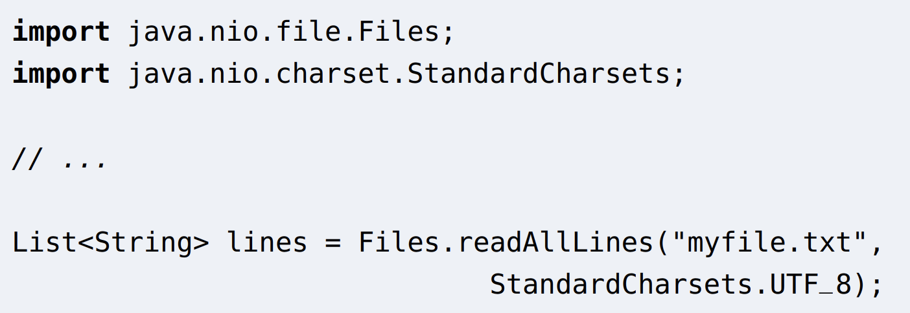

# Exceptions and where to throw them

# Off the "happy path"

- When we write or use a method or function, there's often a "typical" or "normal" or most likely case that can occur
- For instance, consider code for opeing a file and reading a text file in Java:
  
- The typical case is that the file "myfile.txt" exists, and we have permission to read it, so a list of lines will be returned.

# Off cont'd

- So this is one case where we use exceptions: to inform the caller of a method or function about a perfectly predictable circumstance.
  - if such circumstances arise, they dont indicate a logic error or other problem with the calling code
- Easily predictable situations that are off the "happy path"
  - Throw an exception to inform the caller
  - Document what exceptions are thrown and when. These form part of the postconditions.

# Unfixable situations

- page 10 $$$$$$

- page 17 -> page 6
