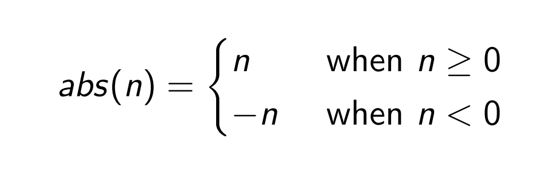
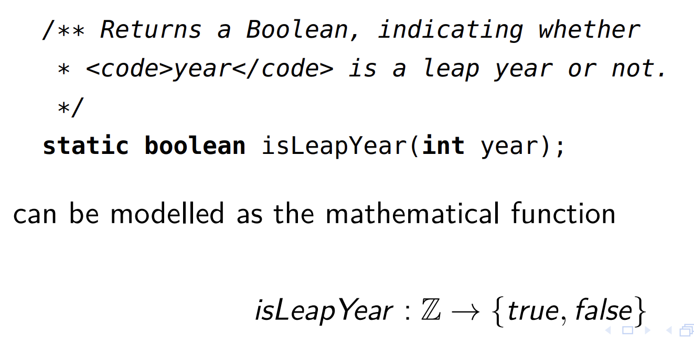
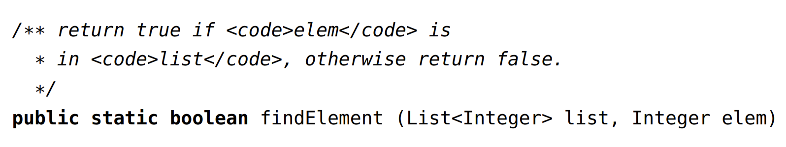

# Input Space Partition Testing

# Input Space Partitioning

## Preliminaries

## Problem - choosing test values

- Suppose we have some hava method we want to test:
  
- What tests should we write?
  - do not write anything about testing "null"s
- When can we stop writing tests?

# Function-like things

- The technique of **Input Space Partitioning** helps us answer these questions.
- If something we are trying to test can be modelled as a mathematical function, then we can apply the ISP technique to devise tests for it (and to check how throgh our testing currently is).
- Before we use it, we'll go through a few mathematical preliminaries

# -abs

- In mathematics, a function is a mapping from one set (called the domain) to another (called the codomain)
- e.g. the function abs gives the absolute value of an integer. Its domain is the integers, and its codomain is the non-negative integers
  

# isLeapYear

- Some Java methods can be very naturally modelled as mathematical functions. **java.lang.Math.abs** was intended to implement that mathematival abs function, so the mathematical function is a natural model.
- As another example, a Java method isLeadpYear, with the following signature and description
  

# mathematics and models

- Models are always simplifications - they abstract from the real world, and leave some details out.
- When we abstract the Java method:

```java
    static boolean isLeapYear(int year)
```

- we're ignoring the fact that a Java int can't actually hold every possible integer value
  - it's limited to the range of values from -2147483648 to 2147483647 (-2^31 ~ 2^31-1)

# Testing functions

- We know that we cant test most java methods exhaustively (for every 4294967296 ints)
- So when modelling something as a function, we rely on important principles:
  - We dont have to test all the inputs to a software component, but can choose representative samples
  - Programmers tend to make mistakes on or around the boundaries of things

# Equivalence classes

- Instead of writing 4294967296 tests for java.lang.Math.abs, we might instead try to ensure that
  - We have tested it with a positive **int**, negative **int**, 0

# Mutating other state

- System.out.println
- println: SetOfPossibleScreenStates(input state) -> SetOfPossibleScreenStates(output state)

# ISP technique

- Let'use the findElement method we saw at the start of the lecture as an example
  
- ISP is about considering the domain for the function - all its possible inputs - and choosing finite sets of values from the input domain to use as **test values**
- Input parameters define the scope of the input domain:
  - Parameters to a method
  - Data read from a file
  - Global variables
  - User level inputs

# ISP technique

- The domain for each input parameter is partitioned into regions
- At least one value is chosen from each region

# Not just methods

- We can apply the ISP technique not just to Java methods, but anything we're able to model as a function.
  - System
    - e.g. a database system. We could consider it as taking in use requests and spitting out reports
  - Hardware
    - e.g. an Internet-controllable toaster. We can consider as taking in toasters settings and untoasted bread, and spitting out toast.
