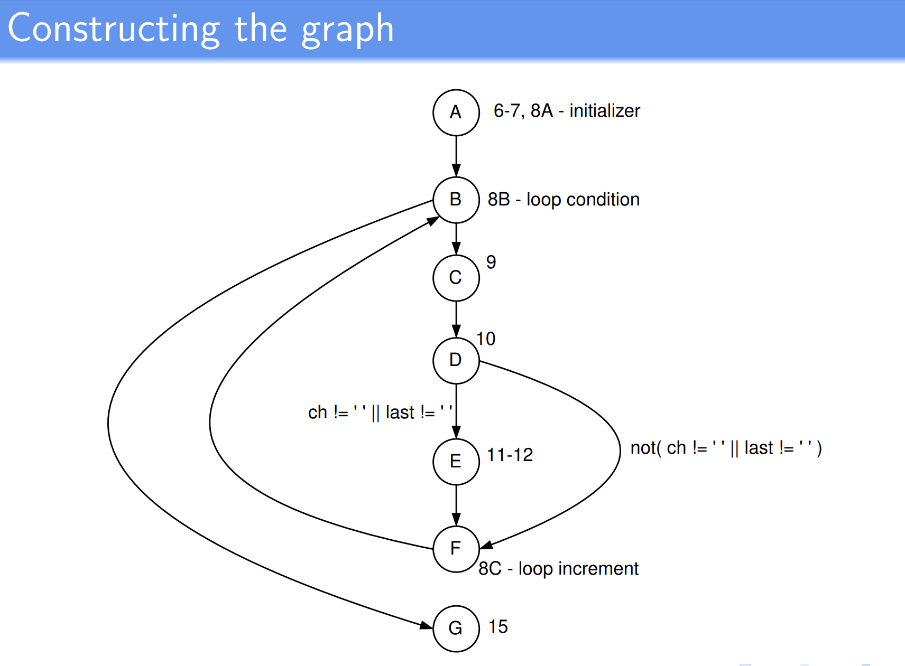
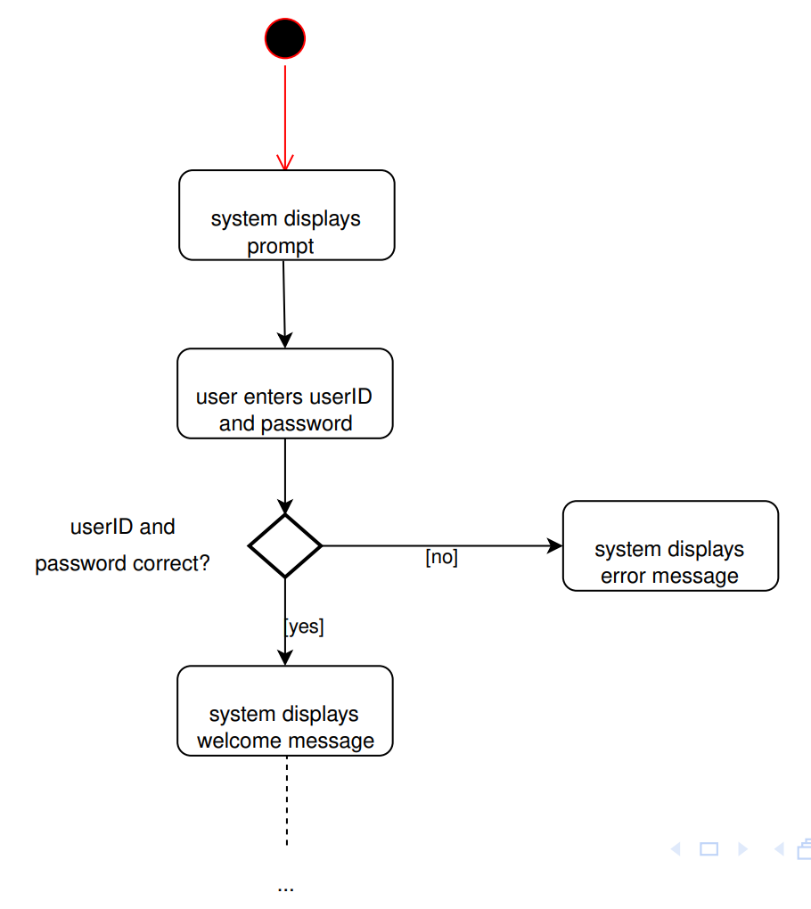
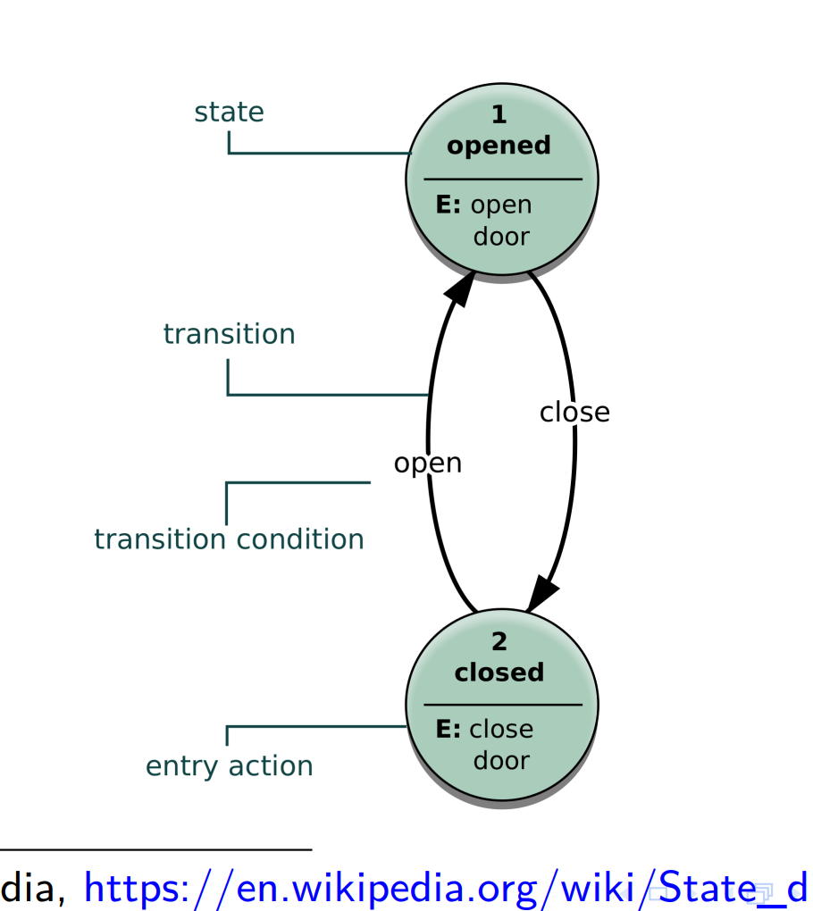

# Model-based testing

# Models and approaches

# Approaches to testing

- For most software components (and other artifacts such as machinery, etc), it's possible to consider them in two ways, when testing:
- Black-box testing:
  - Knowing nothing about the internal workings of the component, we can focus on its intended functionality, and conduct tests that demonstrate each aspect of the functionality, and attempt to uncovers any errors.
- White-box testing:
  - Knowing the internal workings of the componenets, we can write tests that try to check the internal operations are correctly performed, and that all internal components have been adequately execised.
- In reality many testing approaches make use of aspects of both.

# E.g. of "Black-box" testing:

- The sorts of unit tests we have seen so far:
  - They are derived from the specifications for methods, and treat the method as a "black-box" that takes in input and produces output, without considering how it does it.

# E.g. of "White-box" testing:

- Looking at the source code for a method, and ensuring that paths of execution through the method have been adequately tested.

# Black-box testing

- Signature of method, plus specification using Javadoc.

```java
/** Remove/collapse multiple spaces.
 *
 *  @param String string to remove multiple spaces from.
 *  @return String */
public static String collapseSpaces(String argStr)
```

- Specifications need not be for methods, they can be for software components, or hardware, or whole systems.

# White-box testing

- A Java method for collapsing sequences of blanks, taken from the StringUtils class of [Apache Velocity](http://velocity.apache.org), v1.3.1

```java
/*** Romove/collapse multiple spaces
 *
 * @param Sting string to remove multiple spaces from
 * @return String */
public static String collapseSpaces(String argStr){
    char last = argStr.charAt(0);
    StringBuffer argBuf = new StringBuffer();
    for (int cIdx = 0; cIdx < argStr.length(); cIdx++){
        char ch = argStr.charAt(cIdx);
        if(ch != '' || last != ''){
            argBuf.append(ch);
            last = ch;
        }
    }
    return argBuf.toString();
}
```

# Control-flow testing outline

1. Use the source code (or psedocode) to produce a control flow graph
2. Using the graph produce a set of tests for the given program

# Constructing the graph

- In a control flow graph, nodes represent points in the program control flow can go "from" or "to"
- Loops, thrown exceptions and gotos (in languages that have them) are locations control flow can go from - statements representing these spots are "sources"
- Locations control flow can go to are "sinks"



# Black-box techniques

- When we design tests based on the interface - "black-box" testing - we normally work off the specification for the item, we don't care about the details of the implementation
- Input space partition testing (this lecture). We don't need to look at the code within an item being tested - we just consider its parameters or inputs

# Other black-box techniques

- In the Pressman textbook you'll see mention of other black box techniques, e.g. "boundary value analysis"
  - i.e., include tests which have inputs at the "boundaries" of ranges of values
  - This helps detect, for instance "off-by-one" and "fencepost" errors
- Boundary value analysis is actually incorporated into the ISP testing procedure covered in this lecture.
  - When "modeling the input domain", we identify valid values, invalid, boundaries, "normal use", and so on.

# Benefits of black box testing

- Helps finds
  - functionality that is specified but not implemented
  - functionality that is implemented but incorrect

# White-box testing

- We can also design tests by looking at the internal details of an item to be tested - "white-box" or "clear-box" testing
- This is also sometimes called strutural testing, since it looks at the internal struture of an item to be tested
- Here, we do care about the implementation

## e.g.

- As part of white-box testing, we might try to ensure that
  - All internall data structures have been checked
  - All loops have been checked
  - Where there is some sort of branching statement (if-else, case, etc), all the possible branches have been tested

# Why perform white-box testing

- Why perform white-box testing?
  - Isn't black box enough? - after all, it tests the functionality
- What if we've failed to identity some particular scenario (set of inputs) in black box testing, and not written a test for it?
  - It can be difficult to think of unusual inputs/scenarios
- What if the environment, or some other part of the system changes?
  - Code that was previously "dead code", and never executed, might now become "live" - and may contain errors
- Some sorts of errors (e.g. typos) are as likely to occur on unusual or uncommon paths of execution, as on anywhere else.
  - White box testing helps ensure we've considered those paths
- One question that is often asked is "Do we have enough test?"
  - White box testing may not answer that question - but it can identify parts of a system that haven't been tested.

# Types of white-box testing

- In practice and in the literature, many different techniques are identified:
  - branch/decision testing
    - have all branches in decisions been exercised?
  - control flow testing
    - uses a program's control flow graph as a model
  - data flow testing
    - flow of data between variables - are these variables that are declared but not used, or vice versa? Declared multiply? Not initialized before use? Deallocated before use? Used before being validated?
  - statement coverage
    - is every statement executed at least once?
  - modified condition/decision coverage (used in avionics 航空学)
  - path testing
  - prime path testing

# Alternative view - model-based testing

- when doing white-box testing of the collapseSpaces function, we look at the control-flow graph for the function, and try to ensure our tests adequately exercise paths through the graph (called checking the test coverage of the graph)
- But there are many other sorts of "graphs" we might want to check for test coverage, and not all are "internal", "white-box" views of something

# Activity diagrams

- For instance, activity diagrams are ways of modelling a user's interactions with a system.



- These too form a sort of graph, and we can ask whether out tests have exercised paths through the graph sufficiently.
- Activity diagrams don't look at "source code" or the "inside" of a system - they consider the "outside" (a user's interaction with the system)
- So they are a sort of "black-box" testing, yet the same methods we use for control-flow analysis - a form of "white-box" testing - are applicable

# State diagrams

- State digrams show states something can be in, and transitions between them.



- A state diagram also is a kind of graph, so we can look at whether our tests have exercised paths through it sufficientlt
- Is it "black-box" or "white-box" testing?

# Alternative view - model-based testing

- Rather than classifying something as being "black-box" or "white-box" testing, a more useful approach is to consider various models of a software system, and ask "What sort of model is this? And what sort of testing techniques can be applied?"

# Model-based testing - functions

- As we've seen - if we can treat the model as a function from inputs to outputs - then we can apply ISP to it.
  - e.g. Unit tests based on Javadoc specification
  - e.g. System testing based on specifications

# Model-based testing - graphs

- If we can treat the model as a graph - a network of nodes - then we can apply graph-based techinques to it
  - e.g. Control flow analysis

# Model-based testing - logic

- If particular parts of the system make "choices" based on combinations of logical conditions, we can apply logic-based techniques to it.
  - e.g. Avionics systems are required to have a particular level of coverage of logic expressions
  - Sample specification for a system:
    - If the moon is full and the sky is clear, release the monster
    - If the sky is clear and the wind is calm, release the monster

# Model-based testing - logic vs graphs

- Graph-based techniques look at what edges we traverse between nodes, they don't look "inside" the nodes
  - For any "decision node", however complex, graph-based techniques only consider "Which edge do we take out of the node?"
  - By contrast, logic-based testing looks "inside" the parts of boolean expressions making up a "decision point", and asks whether we've tested those parts sufficiently thoroughly
