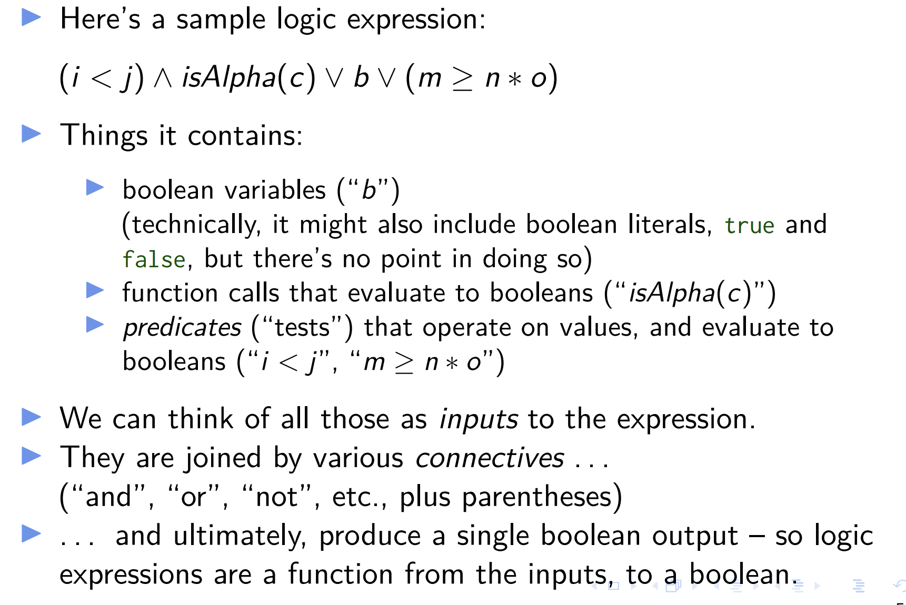
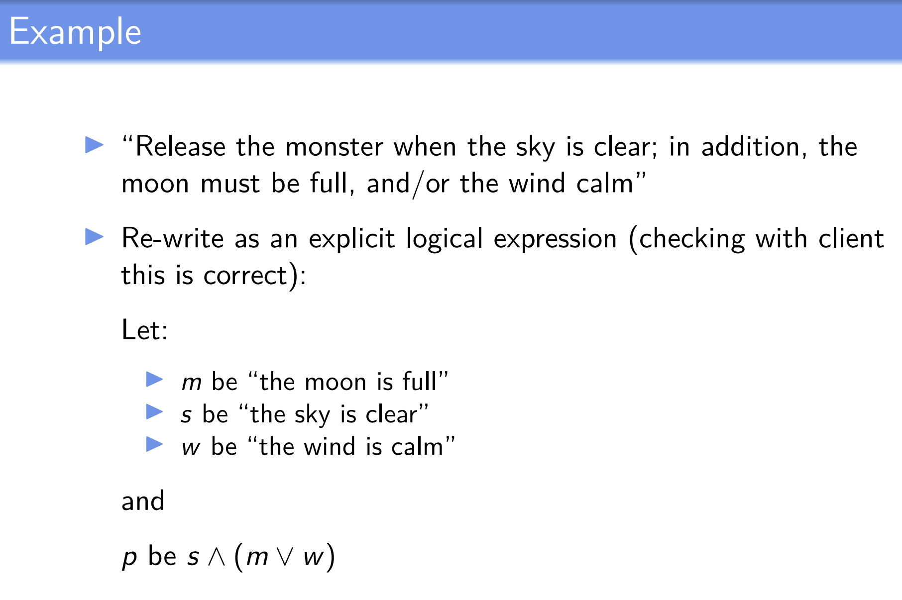

# Logic-Based Testing

- One simplification we made when looking at source flow control was that a decision point was just treated as a "black box" - it might contain a complex boolean condition, but all we cared about was the fact that graoh edges went in, and graph edges came out.
- Modeling the internal struture of the boolean conditions leads us to logic testing - modeling the logical structure of conditions, and checking how well we have exercised different parts of them.

# Logic expressions

- Logic expressions show up in many situations in software systems
  - Decisions in programs
  - State charts
    - A system can move to a different state when particular conditions are satified
  - Use cases
    - A user can take different actions
  - ... pretty much all the things we could model as a graph

# Uses of logic expressions

- As with graph models, we can use logical expressions to identify new tests, assess the coverage of existing tests, and sometimes spot problems in our system
- (e.g. we might have written redundant clauses in a logic expression, that can never in fact be executed - the logic equivalent of "dead code")
- Plus, it's useful to look at logic-based testing, because sometimes it's mandated by legislation

# Structure of logic expressions

- `(i<j)&isAlpha(c)|b|(m>=n*o)`
- 

- If we have some number n of inputs, each of which can be true or false, then there will be 2^n possible inputs in total

# Definitioons

- A predicate is an expression that evaluates to a boolean value. (So the expression as a whole is a predicate, as are some of its parts - e.g. `i<j` )
- Predicates can cotain:
  - Boolean variables
  - non-boolean variables, operated on by relational operators
  - Function or method calls that return a boolean

# Clauses

- A clause is a predicate with no logical connectives
- **b** is a clause, as is `i<j`; they contain no logical connectives

# Active clauses

# Determining predicates

- Informal explanation of when a clause "determines" the value of some predicate
  - Suppose we have some predicate p, with a bunch of clauses in it
  - Let' suppose we're looking at one particular clause, call it c.
  - Whether c "determines" the value of p depends on the values of all the other clauses in p
  - If the values of all the other clauses are such that, whenever we flip c, the value of the whole predicate changes, then we say that c determines the value of p

# Logic expressions

- We will typically extract logic expressions from specifications or source
- When a predicate has only one clause, CoC, CC and ACC all collapse to predicate coverage(PC)
- Applying logic criteria to program source is hard because of reachability and controllability:
  - Reachability: Before applying the criteria on a predicate at a particular statement, we have to get to that statement
  - Controllability: We have to find input values that indirectly assign values to the variables in the predicates
  - (Variables in the predicates that are not inputs to the program are called internal variables)

# Specifications

# Example

## How to do it in a test:

- Suppose we are asked to come up with tests which will satisfy the Restricted active clause coverage criterion
- We must make each of s, m and w active in turn. And the values for the other two clauses must be the same when the clause under consideration is true, as when it is false

1. Making s active
   - s will be active when m|w is true; we just need to pick values of m and s which will make this so. Let's choose m = true, and w = false
   - Now, the value of s determines p
2. Making m active
   - We need s to be true, otherwise p will always be false
   - And we need w to be false, otherwise m|w will always be true
   - So we set s = true, and w = false
   - Now, m determines the value of p
3. Making w active
   - This will be very similar to the last case (since | is what is called "commutative" = like "+" in arithmetic, where a+b=b+a)
   - s must be true, and m must be false
   - And then, w determines the value of p
