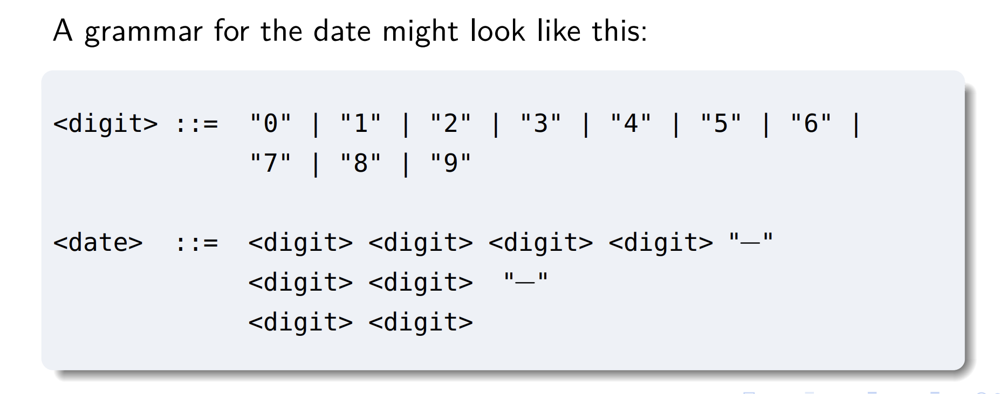
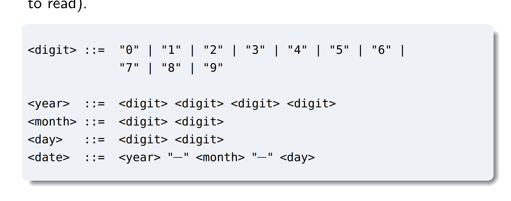

# Syntax-based testing

- Syntax-based models (语法测试)
  - Keeping a not of the rules and symbols we need is useful here (or bring your pre-reading notes)
- Mutation testing (变更测试)

# Grammars, syntax and languaga

- Developers use grammars and syntax of all the time, though they may not realize it.
- Whenever we see a requirement like "a data should be in the format **YYYY-MM-DD**", we're making use of a grammar (though only very informally expressed)

# Analysing a date

- If some requirement says that a parameter to a function, or an item in a database, should be "in the format **YYYY-MM-DD**", what it (usually) means, but more explicitly stated is:
  - Any of the Y's, M's or D's can be replaced by a digit in the range 0-9 - if you provide a date that can't be generated in such a fashin, we might say you've provided a syntactically ill-formed date.
  - There are other rules about validity(e.g. if the first "M" is replaced by a 1, then the second "M" can only be in the range 0-2), but we usually don't consider those to be syntax errors
    - Dates which violate these rule are usually said to violate the semantics of dates, or semantic constraints

# Grammars

- Grammars just give us a way of formally specifying what things are and are not syntactically correct.
- Every grammar defines what is called a language (though not always a very interesting one) - a set of acceptable strings
- 
- The following grammar is equivalent to the previous one - in that they define the exact same set of strings - but provides a few hints as to the semantics of bits of the string (and is probably a bit easier to read)
- 

# Notation

```javascript
<digit> ::= "0" | "1" | "2" | "3" | "4" | "5" | "6" | "7" | "8" | "9" |
<year>  ::= <digit> <digit> <digit> <digit>
<month> ::= <digit> <digit>
<day>   ::= <digit> <digit>
<date>  ::= <year> "-" <month> "-" <day>
```

- The notation is a simplified form of what is called BNF (Backus-Naur-Form)
- The following symbols are used in this notation:

  - We read **"::="** as **"is defined as"** or **"can be expanded to"**, and **"|"** as **"or"**
  - So the first line says, "A 'digit' is defined as being either the string '0', or the string '1', or ..."
  - (These symbols are sometimes called "meta-syntactic symbols", meaning symbols used to define a syntax)

- The things in **strings** are called **terminal symbols** - they are the equivalent of "words" in our language
- They are like atoms, in that they are the smallest, indivisible parts of our language
- In our case, _the terminals are all strings containing a single digit_

- The things between **angle brackets** are called **non-terminal symbols**
- The above grammar contains five rules (also called "productions", in the textbook)
- In the sorts of grammar we will consider, every rule is of the form:
  `non-terminal "::=" sequence of terminals and non-terminals`

- To be precise: the simplest possible right-hand side (RHS) of a rule will be a sequence of terminals and non-terminals, meaning "these strings, concatenated together"
- (For example - the RHS of the last rule, which means "an expansion of the 'year' rule, then a hyphen, then an expansion of the 'month' rule then a hyphen, then an expansion of the 'day' rule")

- But we can also insert on the RHS the following symbols, between or after terminals and non-terminals
  - bars to indicate "or"
  - an asterisk ("Kleene star") to indicate "zero or more of the preceding thing"
  - a plus sign to indicate "one or more of the preceding thing"
  - a range of numbers (e.g. "3-4") to indicate a number of possible instances of the preceding thing

# Use in development

- For very simple programs, we might analyse the arguments "by hand"
- For complex programs - we typically use a command-line argument parser to work out whether a user has supplied a valid set of arguments (and what we should do with them)

- Often, it will be useful to define what are called "domain-specific languages" (DSLs) which describe entities in a domain and things to do with them - e.g. Makefiles are an example of this
- Syntaxes are typically used to defien such languages
